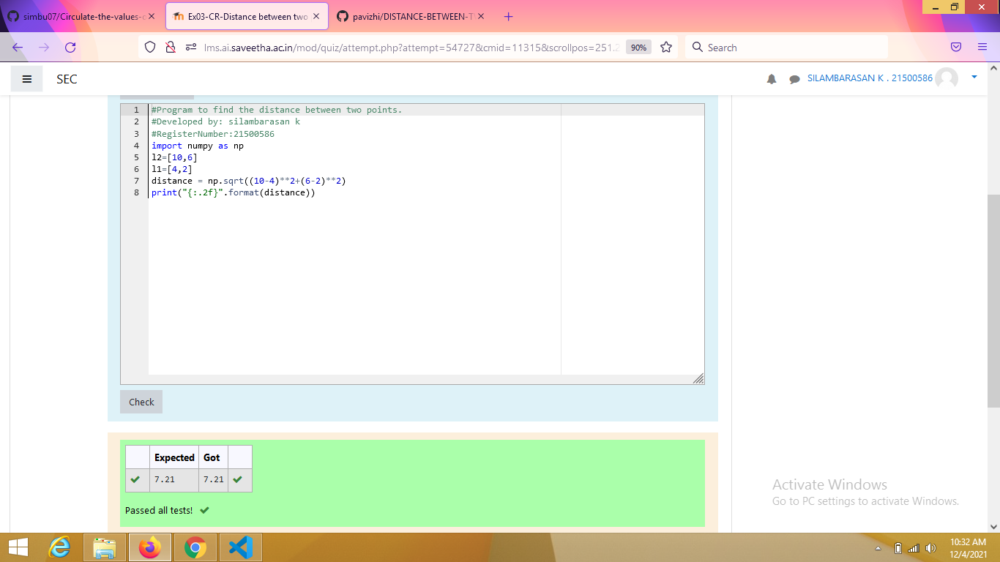

# DISTANCE-BETWEEN-TWO-POINTS

## AIM:
To write a python program to find the distance two 2 points
## ALGORITHM:
### Step 1: 
### Step 2: 
### Step 3: 
Substitute the values in the distance formula  
### Step 4: 
### Step 5: 
### PROGRAM:
```
import numpy as np
l2=[10,6]
l1=[4,2]
distance = np.sqrt((10-4)**2+(6-2)**2)
print("{:.2f}".format(distance))
```
### OUTPUT:



### RESULT:
hus the distance between two points is successfully solved by using a python program.